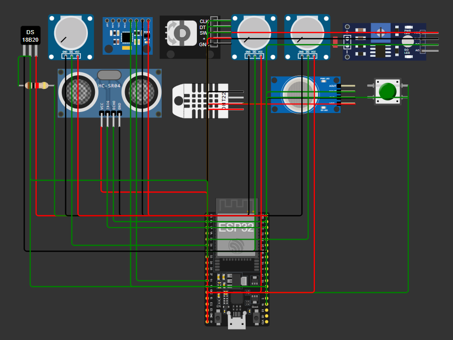

# FireGuard – Monitor de Solo Inteligente

Este projeto utiliza um ESP32 para ler múltiplos sensores de solo e ambiente, tomar decisões de irrigação e exibir tudo num display LCD 16×2 via I²C.

**Simule online no Wokwi:**  
https://wokwi.com/projects/432651667244765185

---

## Sensores e Componentes

| Variável                   | Sensor (Wokwi)               | Pino             | Interface             |
|----------------------------|------------------------------|------------------|-----------------------|
| Temperatura do ar          | DHT22                        | GPIO 25          | digital               |
| Umidade do ar              | DHT22                        | GPIO 25          | digital               |
| Temperatura pontual        | DS18B20                      | GPIO 4           | 1-Wire                |
| Umidade do solo            | Soil Moisture Sensor        | ADC1_CH6 (GPIO34)| `analogRead()`        |
| TDS (nutrientes)           | Potentiometer (TDS)          | ADC1_CH7 (GPIO35)| `analogRead()`        |
| NPK                        | Potentiometer (NPK)          | ADC1_CH5 (GPIO33)| `analogRead()`        |
| Luminosidade               | Photoresistor (LDR)          | ADC1_CH4 (GPIO32)| `analogRead()`        |
| Irrigação ativa            | Relay Module + LED           | GPIO 27 / GPIO26 | digital + OUTPUT      |
| Display LCD 16×2 I²C       | LCD I2C                      | SDA=GPIO21 SCL=GPIO22 | I²C    |

## Print do Circuito

